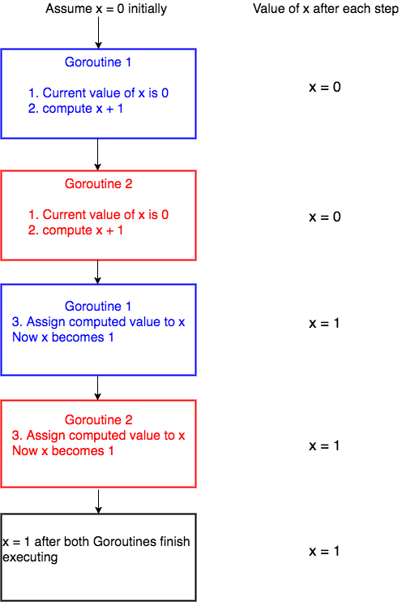

# Concurrency

*Making progress on more than one task simultaneously is known as concurrency. Go has rich support for concurrency using goroutines and channels.*

- [Concurrency vs paralelism](#concurrency-vs-parallelism)
- [Channels](#channels)
- [Race conditions](#race-conditions)
- [Mutex](#1-with-mutex)
- [Context](#context)


## Goroutines

##### What are Goroutines?
*Goroutines are functions or methods that run concurrently with other functions or methods. Goroutines can be thought of as light weight threads. The cost of creating a Goroutine is tiny when compared to a thread. Hence its common for Go applications to have thousands of Goroutines running concurrently* [(golangbot)](https://golangbot.com/goroutines/).  

[The Way to Go. Chapter 14: Goroutines and channels (pdf)](../resources/concurrency_goroutines_channles.pdf)  
```
import (
    "fmt"
    "time"
)

func say(s string) {
    for i := 0; i < 5; i++ {
        time.Sleep(100 * time.Millisecond)
        fmt.Println(s)
    }
}

func main() {
    go say("world") //goroutine
    say("hello")
}
/*
    Will print:
    world
    hello
    hello
    world
    world
    hello
    hello
    world
    world
    hello
*/
```

With a **goroutine** we return immediately to the next line and don't wait for the function to complete.

## Concurrency vs. parallelism

  
<sub>(Image: [brianchan.us](https://brianchan.us/2017/05/27/concurrency-vs-parallelism/))</sub>

- Rob Pike: Concurrency is not parallelism [(video)](https://www.youtube.com/watch?v=cN_DpYBzKso)

## Channels
*Channels are a typed conduit through which you can send and receive values with the channel operator, <-.* 
- [Golangbootcamp](http://www.golangbootcamp.com/book/concurrency)
- [Effective go, channles](https://golang.org/doc/effective_go.html#channels)
  
*Go use channels to synchronize goroutines*
```
ch <- v    // Send v to channel ch.
v := <-ch  // Receive from ch, and
           // assign value to v.
```
*Channels provide a way for two goroutines to communicate with one another and synchronize their execution*. Code examples:  
- [Communicate goroutines through channels](../src/11-channels/channels1.go)           
- [Using a channel to wait the anonymous function execution](../src/11-channels/channels2.go)           
- [All examples...](../src/11-channels)           

```
func main() {
    c := make(chan int)

    go func() {
        for i := 0; i < 10; i++ {
            c <- i  // the code here stops until the next go func  
                    // gets the "i" value
        }
    }()

    go func() {
        for {
            fmt.Println(<-c)    //when println gets the value, then the previous anon. func will loop to the next iteration
        }
    }()

    time.Sleep(time.Second)
}

// example from Todd McLeod training
```
Go has a special statement called select which works like a switch but for channels:
[select example](../src/10-concurrency/select.go)           

#### Channel types
- https://golang.org/ref/spec#Channel_types

#### Close a channel
A sender can close a channel to indicate that no more values will be sent. Receivers can test whether a channel has been closed by assigning a second parameter to the receive expression: after

```
//from: https://tour.golang.org/concurrency/4
v, ok := <-ch
```
[Close channel example](../src/10-concurrency/range-close.go)  

**ok** is false if there are no more values to receive and the channel is closed.  
**Note**: Only the sender should close a channel, never the receiver. Sending on a closed channel will cause a panic.

#### Channel as an function argument

```
func main() {
...
    go googleIt(respond, query)
...
}

func googleIt(respond chan<- string, query string) {
    ...

    respond <- "A Google Response"
}

```
- `chan` means it can take input data or it can pull output data
- `chan<-` means it can only be used to input data
- `<-chan means it can only be used to pull output data

#### Buffered channels
*Buffered channels work similar to unbuffered channels, but with one catch — we can send multiple pieces of data to the channel before needing another go routine to read from it.*  
<sub>[@trevor4e](https://medium.com/@trevor4e/learning-gos-concurrency-through-illustrations-8c4aff603b3)</sub>
```
bufferedChan := make(chan string, 3)
go func() {
 bufferedChan <- "first"
 fmt.Println("Sent 1st")
 bufferedChan <- "second"
 fmt.Println("Sent 2nd")
 bufferedChan <- "third"
 fmt.Println("Sent 3rd")
}()

<-time.After(time.Second * 1)

go func() {
 firstRead := <- bufferedChan
 fmt.Println("Receiving..")
 fmt.Println(firstRead)
 secondRead := <- bufferedChan
 fmt.Println(secondRead)
 thirdRead := <- bufferedChan
 fmt.Println(thirdRead)
}()
```
- [Channel examples](../src/11-channels)

## Race conditions

*Race conditions are among the most insidious and elusive programming errors. They typically cause erratic and mysterious failures, often long after the code has been deployed to production. While Go's concurrency mechanisms make it easy to write clean concurrent code, they don't prevent race conditions. Care, diligence, and testing are required. And tools can help.*
<small>[(Golang blog)](https://blog.golang.org/race-detector)</small>  

  
<sub>(Image: [golangbot.com](https://golangbot.com/mutex/))</sub>

  
<sub>(Image: [William Kennedy](https://www.ardanlabs.com/blog/2013/09/detecting-race-conditions-with-go.html))</sub>

- [Race condition detector](https://golang.org/doc/articles/race_detector.html)

```
$ go test -race mypkg    // to test the package
$ go run -race mysrc.go  // to run the source file
$ go build -race mycmd   // to build the command
$ go install -race mypkg // to install the package
```

*Data races are among the most common and hardest to debug types of bugs in concurrent systems. A data race occurs when two goroutines access the same variable concurrently and at least one of the accesses is a write. See the The Go Memory Model for details.*

```
func main() {
    fmt.Println(getNumber())
}

func getNumber() int {
    var i int
    go func() {
        i = 5
    }()

    return i
}
```

*It’s so easy to detect a potential race condition in Go, that I can’t think of any reason not to include the `-race` flag when building your Go application. The benefits far outweigh the costs (if there even are any) and can contribute to a much more robust application.*

#### WaitGroup

*A WaitGroup waits for a collection of goroutines to finish. The main goroutine calls Add to set the number of goroutines to wait for. Then each of the goroutines runs and calls Done when finished.*  

```
import (
    "sync"
)

var wg sync.WaitGroup

func main() {
    wg.Add(1)   // (add 1 delta to wait the go routine execution) 
                // If we remove WaitGroup feature, the application will end without finish foo execution
    go foo()    // (because go routine)
    wg.Wait()   // It will wait until wg.Done() is executed once
}

func foo() {
    for i := 0; i < 1000; i++ {
        ...
    }
    wg.Done()   //reduce the delta added before
}
```

- [WaitGroup sync package](07-packages.md#pkg-sync-waitgroup) 

## Prevent race conditions

### 1. with mutex

*In computer science, **mu**tual **ex**clusion is a property of concurrency control, which is instituted for the purpose of preventing race conditions; it is the requirement that one thread of execution never enter its critical section at the same time that another concurrent thread of execution enters its own critical section.* ([wiki])

[wiki]: https://en.wikipedia.org/wiki/Mutual_exclusion 

- [**GolangBot, how to solve race conditions using mutexes and channels**](https://golangbot.com/mutex/)
- [Data race and how to fix it](https://www.sohamkamani.com/blog/2018/02/18/golang-data-race-and-how-to-fix-it/)
- [Golang pkg Mutex](https://golang.org/pkg/sync/#Mutex)
- [Use a sync.Mutex or a channel?](https://github.com/golang/go/wiki/MutexOrChannel)
- [A Tour of Go, mutex](https://tour.golang.org/concurrency/9)

```
counter := 0

const gs = 100
var wg sync.WaitGroup
wg.Add(gs)

var mu sync.Mutex

for i := 0; i < gs; i++ {
    go func() {
        mu.Lock()           //lock the execution for another go routine  
        v := counter        //until unlock is executed
        runtime.Gosched()   // *
        v++
        counter = v
        mu.Unlock()
        wg.Done()
    }()
    fmt.Println("Goroutines:", runtime.NumGoroutine())
}
wg.Wait()

```

[* runtime.Gosched, stackoverflow](https://stackoverflow.com/questions/13107958/what-exactly-does-runtime-gosched-do)  

*When execution context in one goroutine reaches Gosched call, the scheduler is instructed to switch the execution to another goroutine.*  

### 2. with atomic counters
*Package atomic provides low-level atomic memory primitives useful for implementing synchronization algorithms.*

```
package main

import (
	"fmt"
	"runtime"
	"sync/atomic"
	"time"
)

type atomicCounter struct {
	val int64
}

func (c *atomicCounter) Add(x int64) {
	atomic.AddInt64(&c.val, x)
	runtime.Gosched()
}

func (c *atomicCounter) Value() int64 {
	return atomic.LoadInt64(&c.val)
}

func main() {
	counter := atomicCounter{}

	for i := 0; i < 100; i++ {
		go func(no int) {
			for i := 0; i < 10000; i++ {
				counter.Add(1)
			}
		}(i)
	}

	time.Sleep(time.Second)
	fmt.Println(counter.Value())
}
```
- [GoByExample.com](https://gobyexample.com/atomic-counters)
- [Jacek Wysocki DevLog](http://wysocki.in/golang-concurrency-data-races/#example-2-atomic-counters:59379cce1c625dd15951f4c54912cbba)
- [Golang.org](https://golang.org/pkg/sync/atomic/)
- [Incrementor, avoid race condition with atomic counters](channels14-incrementor-avoid-race-with-atomic)


## Context

*In Go servers, each incoming request is handled in its own goroutine. Request handlers often start additional goroutines to access backends such as databases and RPC services. The set of goroutines working on a request typically needs access to request-specific values such as the identity of the end user, authorization tokens, and the request's deadline. When a request is canceled or times out, all the goroutines working on that request should exit quickly so the system can reclaim any resources they are using. At Google, we developed a context package that makes it easy to pass request-scoped values, cancellation signals, and deadlines across API boundaries to all the goroutines involved in handling a request. The package is publicly available as context. This article describes how to use the package and provides a complete working example.*  

- https://blog.golang.org/context 
- [Finally some context: Request scoped state in Go 1.7](https://medium.com/@matryer/context-has-arrived-per-request-state-in-go-1-7-4d095be83bd8) 
- https://peter.bourgon.org/blog/2016/07/11/context.html
- https://golang.org/pkg/context/ 

```
package main

import (
	"context"
	"fmt"
	"runtime"
	"time"
)

func main() {
	ctx, cancel := context.WithCancel(context.Background())

	fmt.Println("error check 1:", ctx.Err())
	fmt.Println("num gortins 1:", runtime.NumGoroutine())

	go func() {
		n := 0
		for {
			select {
			case <-ctx.Done():
				return
			default:
				n++
				time.Sleep(time.Millisecond * 200)
				fmt.Println("working", n)
			}
		}
	}()

	time.Sleep(time.Second * 2)
	fmt.Println("error check 2:", ctx.Err())
	fmt.Println("num gortins 2:", runtime.NumGoroutine())

	fmt.Println("about to cancel context")
	cancel()
	fmt.Println("cancelled context")

	time.Sleep(time.Second * 2)
	fmt.Println("error check 3:", ctx.Err())
	fmt.Println("num goroutines 3:", runtime.NumGoroutine())
}
```

---

## Links

- [Resources for learning concurrency in Go](https://github.com/golang/go/wiki/LearnConcurrency)
- [Concurrency, Effective Go](https://golang.org/doc/effective_go.html#concurrency)
- [**Concurrency & goroutines, Golang Book**](https://www.golang-book.com/books/intro/10)
- [Multithreading in go, Cory Finger](https://pragmacoders.com/multithreading-go-tutorial/)
- [Learning Go’s Concurrency Through Illustrations](https://medium.com/@trevor4e/learning-gos-concurrency-through-illustrations-8c4aff603b3)  
- [Concurrency & channels, GolangBootCamp](http://www.golangbootcamp.com/book/concurrency)
- [Step-by-step guide to concurrency](https://yourbasic.org/golang/concurrent-programming/)
- [Go routines explained](https://yourbasic.org/golang/goroutines-explained/) 
- [GoRoutines, A Tour of go](https://tour.golang.org/concurrency/1)
- [Graceful upgrades in go](https://blog.cloudflare.com/graceful-upgrades-in-go/)
- Fan-in / Fan-out:
    - [Golang blog](https://blog.golang.org/pipelines#TOC_4.)
    - [Concurrency patterns: fan-in/fan-out, futures](https://medium.com/@thejasbabu/concurrency-patterns-golang-5c5e1bcd0833)
    - [Fan-in/out messaging](http://tmrts.com/blog/fan-in--fan-out-messaging-patterns/)

#### Vídeos  

- [Introduction to Go Goroutine - Concurrency in Go, TutorialEdge](https://www.youtube.com/watch?v=ARHXmR0_MGY)
- Visualizing Concurrency in Go, Ivan Danyliuk
    - [Video](https://www.youtube.com/watch?v=KyuFeiG3Y60)
    - [Post](http://divan.github.io/posts/go_concurrency_visualize/)
- [Rob Pike: Concurrency is not parallelism](https://www.youtube.com/watch?v=cN_DpYBzKso)
- [Rob Pike: Go concurrency patterns](https://www.youtube.com/watch?v=f6kdp27TYZs)
- [Sameer Ajmani: Advanced Go Concurrency Patterns](https://www.youtube.com/watch?v=QDDwwePbDtw)